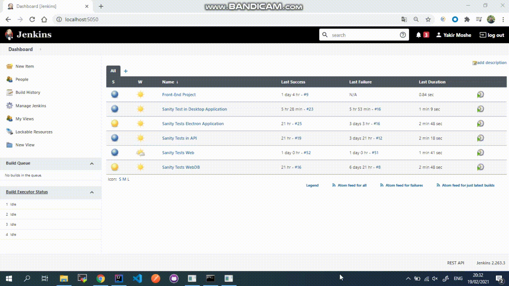

# **Full Stack Automation Final Project** 
This project created to demonstrate my knowledge and skills in Automation Testing with 6 Platforms: API, DB, Desktop, Electron, Mobile, Web.

## ***Short videos for:***

### **_Full Stack Automation on Web_**

---

### **_Full Stack Automation on Electron app_**

---

### **_Full Stack Automation on Desktop App_**

---

### Table of Contents

- [Description](#description)
- [Technologies](#Technologies)
- [Infrastructure project includes using of](#Infrastructure-project-includes-using-of)
- [List of applications were used in this project](#List-of-applications-were-used-in-this-project)
- [Tools & Frameworks used in the project](#Tools-&-Frameworks-used-in-the-project)
- [Tests Execution](#Tests-Execution)
- [Author Info](#Connect-with-me)

---

## **_Description_**

The project demonstates a smart automation infrastructure. It is built in hierarchy order of modules. The modules contain number of classes with methods.
There are main/common/helpers/actions/page_object modules.
In this way, the tests can be created in very simple way with a minimum lines of code.
Also the infrastructure allows to work with differend kinds of applications.

#### _Technologies_

- Web based application
- Mobile application
- Web API
- Electron application
- Desktop application
- Database Integration

---

### **_Infrastructure project includes using of_**

* Page Object Design Pattern
* Project Layers(Extensions/Work Flows/Test Cases...)
* Support of Different Clients/Browsers
* Failure Mechanism
* Common Functionality
* External Files Support
* Reporting System (including screenshots)
* Visual Testing
* TestNG Suite File
* DB support
* CI support 

---

### **_List of applications were used in this project_**

* Grafana webpage - Web based application
* Mortgage calculator - Mobile application
* Grafana API - Web API
* Grafana DataBase  - Web DB  
* Electron application
* Windows calculator - Desktop application

---

### **_Tools & Frameworks used in the project_**

* TestNG - Testing Framework
* Listeners - interface used to generate logs and customize the TestNG reports
* MySQL Free Online DB - used for login to Grafana web page
* [Jenkins](https://www.jenkins.io/)- for tests execution
* REST Assured - for API testing
* [Allure](http://allure.qatools.ru/) Reports - as the main reporting system

---

### **_Tests Execution_**

> Each of the applications has a few tests for demonstration purpose.
These tests can be developed in a very simple way, due to a lot of work with the infrastructure.
[[Sanity Tests]](https://github.com/YakirMoshe/Full-Stack-Automation-Final-Project/tree/main/Full_Stack_Automation_Final_Project/src/test/java/sanity)

---

## **_Connect with me_**

* [][linkedin]
 

---

[Back To The Top](#Full-Stack-Automation-Final-Project)

[linkedin]: https://linkedin.com/in/yakir-moshe